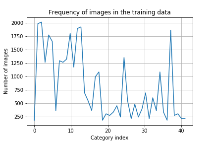

# **Traffic Sign Recognition** 

## Writeup

---

**Build a Traffic Sign Recognition Project**

The goals / steps of this project are the following:
* Load the data set (see below for links to the project data set)
* Explore, summarize and visualize the data set
* Design, train and test a model architecture
* Use the model to make predictions on new images
* Analyze the softmax probabilities of the new images
* Summarize the results with a written report

[//]: # (Image References)

[image1]: ./examples/visualization.jpg "Visualization"
[image2]: ./examples/grayscale.jpg "Grayscaling"
[image3]: ./examples/random_noise.jpg "Random Noise"
[image4]: ./examples/web/00000_00023.jpg "Traffic Sign 1"
[image5]: ./examples/web/00006_00026.jpg "Traffic Sign 2"
[image6]: ./examples/web/00012_00018.jpg "Traffic Sign 3"
[image7]: ./examples/web/00020_00024.jpg "Traffic Sign 4"
[image8]: ./examples/web/00025_00025.jpg "Traffic Sign 5"

## Rubric Points
### Here I will consider the [rubric points](https://review.udacity.com/#!/rubrics/481/view) individually and describe how I addressed each point in my implementation.  

---
### Writeup / README

#### 1. Provide a Writeup / README that includes all the rubric points and how you addressed each one. You can submit your writeup as markdown or pdf. You can use this template as a guide for writing the report. The submission includes the project code.

I have submitted this project directly from the Udacity workspace, so the iPython notebook should already be included with this file.

### Data Set Summary & Exploration

#### 1. Provide a basic summary of the data set. In the code, the analysis should be done using python, numpy and/or pandas methods rather than hardcoding results manually.

When the data is loaded into memory with pickle, internally the Xs and Ys are represented as `numpy.ndarray`s. With this knowledge, it was easy to call the `shape` method to find out some statistics about the dataset.

* The size of training set is `34799`.
* The size of the validation set is `4410`
* The size of test set is `12630`
* The shape of a traffic sign image is `(32,32,3)`
* The number of unique classes/labels in the data set is `43`

#### 2. Include an exploratory visualization of the dataset.

For training machine learning models for classificaion, it is very important to consider the distribution of classes in the training data. A well balanced dataset consists of frequency of training data for each class in proportion with the likelihood of encountering the class in the real world when the model is deployed. Here we visualize the frequency of occurence of images for each category in the training data.

We clearly see that some classes are represented more heavily than others during training. It is not possible to conclude from this information alone if there is a class imbalance in the training data. If the training data faithfully represents the validation and test datasets, the trained model will have similar accuracy for all three sets of data. We cognize that we may have to come back and augment data to balance the classes in the training set, but at the outset we do not know if that will be necessary.

A more detailed visualization of the dataset along with example images of each class has been presented in the jupyter notebook.

### Design and Test a Model Architecture

#### 1. Describe how you preprocessed the image data. What techniques were chosen and why did you choose these techniques? Consider including images showing the output of each preprocessing technique. Pre-processing refers to techniques such as converting to grayscale, normalization, etc. (OPTIONAL: As described in the "Stand Out Suggestions" part of the rubric, if you generated additional data for training, describe why you decided to generate additional data, how you generated the data, and provide example images of the additional data. Then describe the characteristics of the augmented training set like number of images in the set, number of images for each class, etc.)

When we loaded MNIST data into the LeNet lab, we implicitly loaded a pre-processed data in which the images were all scaled from 0 to 1.
In general, for complex images, we can do better to center and scale the data. The standard technique for image pre-processing is mean centering and scaling with standard deviation. I am unable to find a research paper introducing this technique, but it has been in common practice among deep learning practitioners for a very long time now. Here is an example of a [blog post](https://becominghuman.ai/image-data-pre-processing-for-neural-networks-498289068258) explaining this normalization technique.

We computed the pixel wise mean of all the images in the training data for each channel and divided it by the (scalar) standard deviation of the training images across all training images.

Thus, `normalized_image=(original_image-pixelwise_mean)/stdev`.

It is important to note that I chose not to convert the images into grayscale because the color information contained within images can be very helpful for the network to classify the symbols. For example, stop sign is usually red in color. If we convert the images into grayscale it would discard the color information and make it harder for the network to learn the differences between different traffic signs.

Additional data was not generated in this project. We rather depended on improvements to the network architecture to get performance boost.

#### 2. Describe what your final model architecture looks like including model type, layers, layer sizes, connectivity, etc.) Consider including a diagram and/or table describing the final model.

My final model consisted of the following layers:

| Layer         		|     Description	        					| 
|:---------------------:|:---------------------------------------------:| 
| Input         		| 32x32x3 RGB image   							| 
| Convolution 5x5     	| 2x2 stride, same padding, outputs 16x16x32 	|
| Swish activation					|												                                 |
| Convolution 3x3	      	| 2x2 stride,  outputs 8x8x64 				|
| Swish activation		|        									|
| Convolution		3x3		| 2x2 stride,  outputs 4x4x128        									|
| Swish activation					|												|
|	Flatten layer					|	output 2048											|
|	Fully connected					|	256 neurons											|
| Relu activation					|												| 
|	Fully connected					|	43 outputs											|

The network takes a `32x32x3` RGB image as input and has a `5x5` convolution layer with stride `2x2`. This is followed by Swish activation. Similarly, two more convolution layers of filter size `3x3` follow. We then have a flatten layer followed by two fully connected layers of `256` and `43` neurons. The last layer represents the output logits. 

There are a few choices which deserve special mention:
- The choice of strides 2x2 was used to downsample the data instead of having a separate pooling layer. This is in line with several modern CNN architecutres which use the conv layer for downsampling as well as convolution.
- We used swish activation rather than the commonly used relu. Swish activation was introduced by [Ramachandran et. al.](https://arxiv.org/abs/1710.05941v1) in 2017. This is a non-monotonic activation function defined as `Swish(x)=x*sigmoid(x)` which has been shown to have better results than relu. When this paper came out, I wrote a couple of blog posts explaining the [function](https://medium.com/@jaiyamsharma/experiments-with-swish-activation-function-on-mnist-dataset-fc89a8c79ff7) and its performance on [ResNet](https://medium.com/@jaiyamsharma/swish-in-depth-a-comparison-of-swish-relu-on-cifar-10-1c798e70ee08). My conclusions at the time were not definitive. In particular, I found that, as expected, the `sigmoid` part was computationally much more expensive than relu and thus inference using swish was slower. However, recently the MobileNet team at Google has introduced a much faster version of swish, called [h-swish](https://ai.googleblog.com/2019/11/introducing-next-generation-on-device.html?m=1&fbclid=IwAR2cAnHMPPMBtSbeGzsyxFmVR4WnrZFlD4FIwCpIxh4pN8IzMMriNXRjgHY), which is represented as a product of two piecewise linear functions. This allows very fast inference while retaining the improvements of training accuracy from swish. While training, I found that swish activation indeed produced better accuracy on validation set by about 2% from relu on the German traffic signs dataset. I did not implement h-swish but left it as future work since we are not deploying this model on an edge device in this assignment.
- Another important choice is the number of filters used in the conv blocks. I purposefully chose a large number of filters (32, 64 and 128) in the three layers as it has been [shown](https://arxiv.org/abs/1605.07146) that shallow CNNs with many filters (i.e. wider CNNs) are able to outperform deeper CNNs with many more parameters. During exploration of architecures, I confirmed that the wider network indeed produced better results than deeper ones on this dataset.
- Finally, I would like to mention that I have not hardcoded `tf.nn.softmax` into the architecture of the network to obtain normalized probabilities as the argmax can be obtained from the logits themselves. To get the probabilities we call `tf.nn.softmax` directly with the invocation of `sess.run`. This does not change the performance of the network and is a trivial change to the architecture.

#### 3. Describe how you trained your model. The discussion can include the type of optimizer, the batch size, number of epochs and any hyperparameters such as learning rate.

- Optimizer: I used the tried and tested Adam Optimizer. The default hyperparameters of beta1 and beta2 were used as they worked well for this dataset.
- batch size: I used a batch size of 32. I found this to be a good compromise between training time and accuracy. A lower batch size introduced too much noise into the estimation of gradients and a higher batch size produced a lower accuracy due to the fewer number of back-props throught the network for a given number of epochs.
- We used 10 epochs for training. The network achieved an accuracy of 93% within 7 epochs and maintained it for the remaining three epochs, confirming that the monimum found by the optimizer was not a shallow local minima but a fairly broad one.
- Learning rate: I used an exponentially decreasing learning rate. Training started off from a relatively high learning rate of `0.003` in the first epoch which was successively decreased by a factor of `1.4` in each epoch. Thus, the network trained at a learning rate > `0.001` for the first three epochs.

Here, I would like to note that the improvements in network architecture and an optimized learning rate schedule allowed the network to achieve an accuracy of `0.93` within just 7 epochs. I performed ablation analysis by changing each of the choices mentioned above and found that each choice contributes to increasing accuracy and reduced training time without the necessity of data augmentation.

#### 4. Describe the approach taken for finding a solution and getting the validation set accuracy to be at least 0.93. Include in the discussion the results on the training, validation and test sets and where in the code these were calculated. Your approach may have been an iterative process, in which case, outline the steps you took to get to the final solution and why you chose those steps. Perhaps your solution involved an already well known implementation or architecture. In this case, discuss why you think the architecture is suitable for the current problem.

My final model results were:
* training set accuracy of 1.00
* validation set accuracy of 0.934
* test set accuracy of 0.923

If an iterative approach was chosen:
* What was the first architecture that was tried and why was it chosen?
* What were some problems with the initial architecture?
* How was the architecture adjusted and why was it adjusted? Typical adjustments could include choosing a different model architecture, adding or taking away layers (pooling, dropout, convolution, etc), using an activation function or changing the activation function. One common justification for adjusting an architecture would be due to overfitting or underfitting. A high accuracy on the training set but low accuracy on the validation set indicates over fitting; a low accuracy on both sets indicates under fitting.
* Which parameters were tuned? How were they adjusted and why?
* What are some of the important design choices and why were they chosen? For example, why might a convolution layer work well with this problem? How might a dropout layer help with creating a successful model?

If a well known architecture was chosen:
* What architecture was chosen?
* Why did you believe it would be relevant to the traffic sign application?
* How does the final model's accuracy on the training, validation and test set provide evidence that the model is working well?

I used a combination of well-known architecural improvements (such as wide networks), hyperparameter optimization as well as experimental features such as the use of swish activation function. Ablation studies were carried out to determine whether a given choice (relu/swish, constant/variable learning rate, narrower/wider conv block) led to improved accuracy or reduced training time. The choices which led to imporved accuracy were adopted. Thus, the network ended up using swish activation, variable (exponetially decaying) learning rate and wide convolutional blocks. I would like to mention that I did not use dropout which could have improved the accuracy further. This is a possible improvement for this architecture.

### Test a Model on New Images

#### 1. Choose five German traffic signs found on the web and provide them in the report. For each image, discuss what quality or qualities might be difficult to classify.

Here are five German traffic signs that I found on the web:

![alt text][image4] ![alt text][image5] ![alt text][image6] 
![alt text][image7] ![alt text][image8]

- The first image has very poor lighting conditions. 
- The second image suffers from motion blur which makes the sign hard to recognize. 
- The third image again suffers from ppor lighting conditions. 
- The fourth image is of very good quality and should be the easiest one among these to classify. 
- The fifth image is taken from an oblique angle and can be challenging to classify.

#### 2. Discuss the model's predictions on these new traffic signs and compare the results to predicting on the test set. At a minimum, discuss what the predictions were, the accuracy on these new predictions, and compare the accuracy to the accuracy on the test set (OPTIONAL: Discuss the results in more detail as described in the "Stand Out Suggestions" part of the rubric).

Here are the results of the prediction:

| Image			        |     Prediction	        					| 
|:---------------------:|:---------------------------------------------:| 
| Right-of-way at the next intersection
      		| Right-of-way at the next intersection
   									| 
| No entry     			| No entry 										|
| Stop					| Stop											|
| General caution	      		| General caution					 				|
| Vehicles over 3.5 metric tons prohibited			| End of no passing      							|

The model was able to correctly guess 4 of the 5 traffic signs, which gives an accuracy of 80%. Images with poor lighting conditions, motion blur etc were correctly classified by the network. However, the last image was incorrectly classified as `End of no passing`. I purposefully chose this image to belong to a class which has only 360 images in the training data (about 1% of the training set). This shows that classes with very few images are challenging to classify. Printing out the top 5 predictions for this image shows that the correct classification occurs within the top 5 predictions of the network (class index 16) showing that the network is indeed learning the correct classification, but is unable to perform well on this class due to the limited number of training examples. I acknowledge that generating symthetic training data may imporve the performance on this particular image, but the purpose of this exploration is to find weaknesses in the network and not to present a flawless picture of the capabilities of the neural network.

#### 3. Describe how certain the model is when predicting on each of the five new images by looking at the softmax probabilities for each prediction. Provide the top 5 softmax probabilities for each image along with the sign type of each probability. (OPTIONAL: as described in the "Stand Out Suggestions" part of the rubric, visualizations can also be provided such as bar charts)

The code for making predictions on my final model is located in the 26th cell of the Ipython notebook.

For the first image, the model is relatively sure that this is a `Right-of-way at the next intersection` (probability of 1.0), and the image is correctly classified. The top five soft max probabilities were

| Probability         	|     Prediction	        					| 
|:---------------------:|:---------------------------------------------:| 
| 1.00         			| Right-of-way at the next intersection   									| 
| 0.00     				| Pedestrians 										|
| 0.00					| Traffic signals											|
| 0.00	      			| Double curve					 				|
| 0.00				    | No entry      							|

For the second image, the model is relatively sure that this is a `No entry` sign (probability of 1.0), and the image is correctly classified. The top five soft max probabilities were

| Probability         	|     Prediction	        					| 
|:---------------------:|:---------------------------------------------:| 
| 1.00         			| No entry  									| 
| 0.00     				| Stop 										|
| 0.00					| Speed limit (20km/h)											|
| 0.00	      			| Speed limit (30km/h)					 				|
| 0.00				    | Yield      							|

For the third image, the model is relatively sure that this is a `Stop` sign (probability of 1.0), and the image is correctly classified. The top five soft max probabilities were

| Probability         	|     Prediction	        					| 
|:---------------------:|:---------------------------------------------:| 
| 1.00         			| Stop  									| 
| 0.00     				| Speed limit (80km/h) 										|
| 0.00					| No entry											|
| 0.00	      			| Road work					 				|
| 0.00				    | No passing for vehicles over 3.5 metric tons      							|

For the fourth image, the model is relatively sure that this is a `General caution` sign (probability of 1.0), and the image is correctly classified. The top five soft max probabilities were

| Probability         	|     Prediction	        					| 
|:---------------------:|:---------------------------------------------:| 
| 1.00         			| General caution  									| 
| 0.00     				| Pedestrians 										|
| 0.00					| Traffic signals											|
| 0.00	      			| Right-of-way at the next intersection				 				|
| 0.00				    | Road work      							|

For the fifth image, the model is unsure that this is a `End of no passing` sign (probability of 0.81), and the image is incorrectly classified. The top five soft max probabilities were

| Probability         	|     Prediction	        					| 
|:---------------------:|:---------------------------------------------:| 
| 0.81         			| End of no passing  									| 
| 0.1     				| End of speed limit (80km/h) 										|
| 0.07					| End of all speed and passing limits											|
| 0.01	      			| Roundabout mandatory				 				|
| 0.002				    | Vehicles over 3.5 metric tons prohibited      							|

Here we see that among the five images, the model is most unsure of this one and indeed this image is incorrectly classified. As discussed in the previous section, the correct classification appears among the top 5 prediction showing that the network is learning the correct classification and is strapped for more samples of this class.

### (Optional) Visualizing the Neural Network (See Step 4 of the Ipython notebook for more details)
#### 1. Discuss the visual output of your trained network's feature maps. What characteristics did the neural network use to make classifications?

